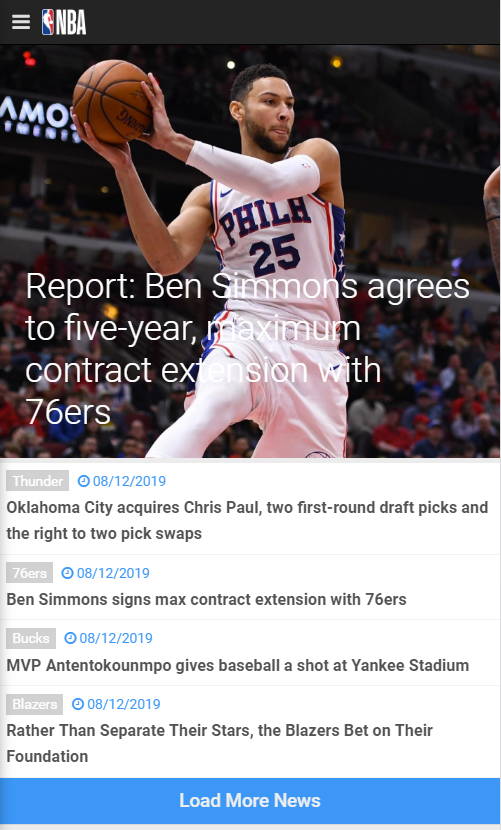
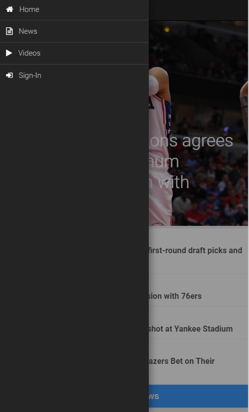
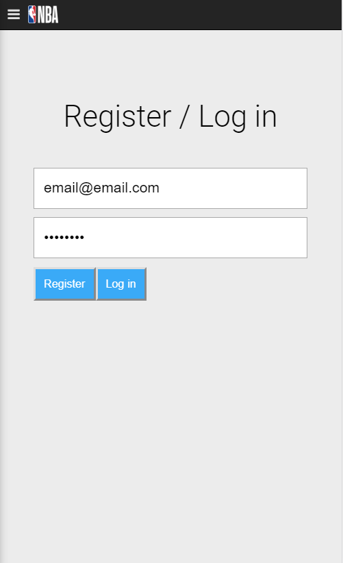
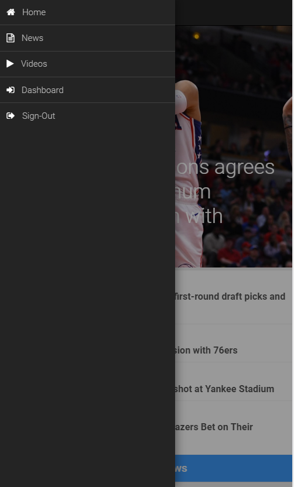
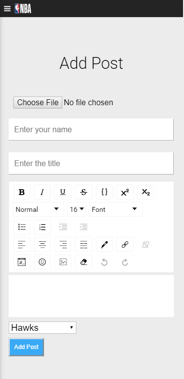

# NBA React App
This is a clone of the NBA mobile web app. It was created with React and uses Firebase for its database. The project was done through the course [The complete React Fullstack course](https://www.udemy.com/the-complete-react-fullstack-course/ "The complete React Fullstack course").

Link to hosted app ---> https://nba-full-ee548.firebaseapp.com/

Note: the app is only optimized for mobile. 

### Screenshots

<h6>Navigation before signing in</h6>

<h6>Navigation after signing in</h6>

### Features
- A home page with sections for news and videos as well as dedicated news and videos pages, each with dynamic loading.
- Logging in and logging out with authentication via firebase.
- Posting section for new articles if user is logged in.

### All you need if downloading the app and running it locally

In the project directory, you can run:

### `npm start`

Runs the app in the development mode. 
Open [http://localhost:3000](http://localhost:3000) to view it in the browser.

The page will reload if you make edits. 
You will also see any lint errors in the console.

